ARCHIVO README CON LA EXPLICACIÓN DE LAS NUEVAS FUNCIONALIDADES AÑADIDAS AL PROYECTO USANDO JS

1-AÑADIR RESEÑAS DEL RESTAURANTE
En la imagen se puede ver el codigo HTML donde haciendo uso del DOM mediante js se le añadiran los datos de la reseña.
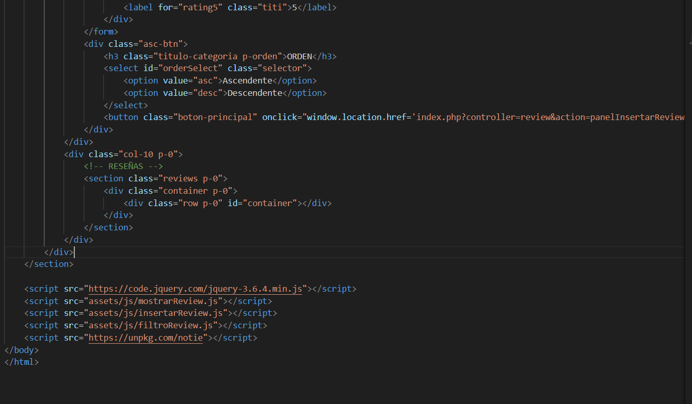

En esta imagen se puede ver el js que se encarga de hacer una peticion a la api con la accion de 'buscar_review' para recuperar los datos de las reseñas y posteriormente mediante el DOM añadirlas al HTML.
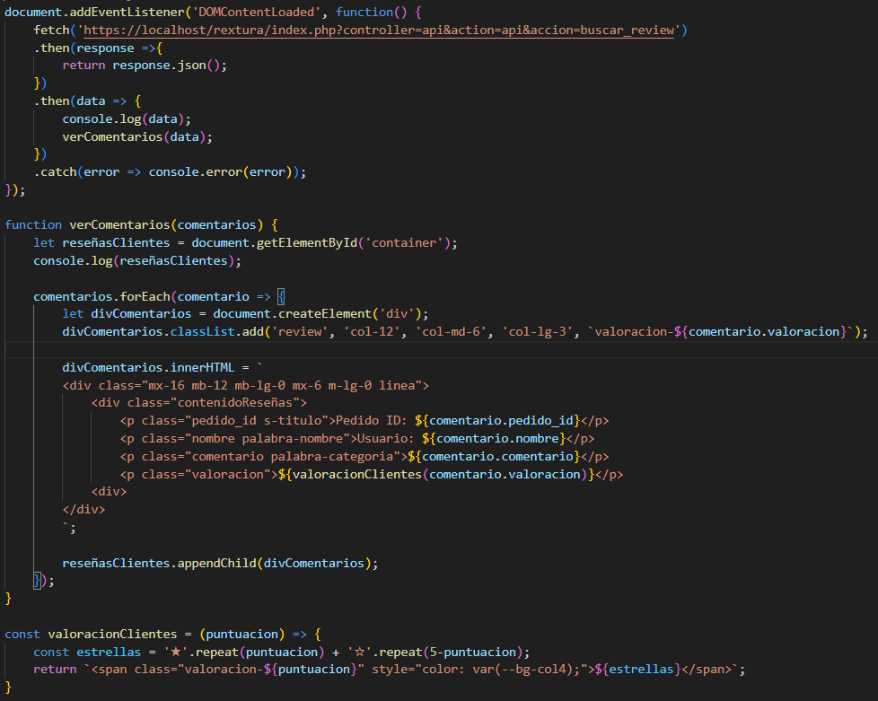

Así es como se gestiona la peticion en la api.
![alt text]img/(image-2.png)

Esta es la funcion en reviewDAO para mostrar las reseñas.
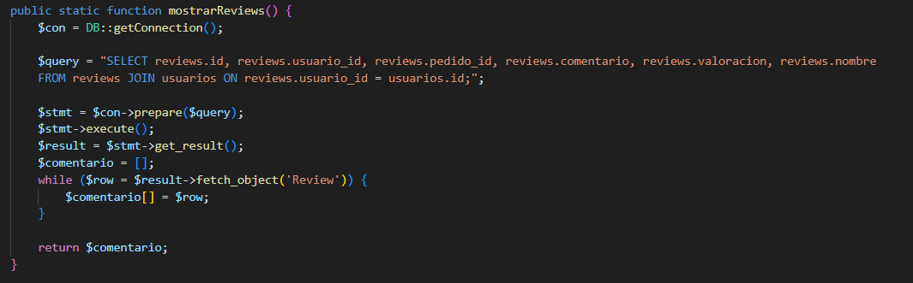

En esta imagen se ve el HTML para añadir la reseña, la cual tiene un js para acceder a los datos e insertarlos a la base de datos, también hece uso de una funcion para solo mostrar los pedidos que no tienen reseña.
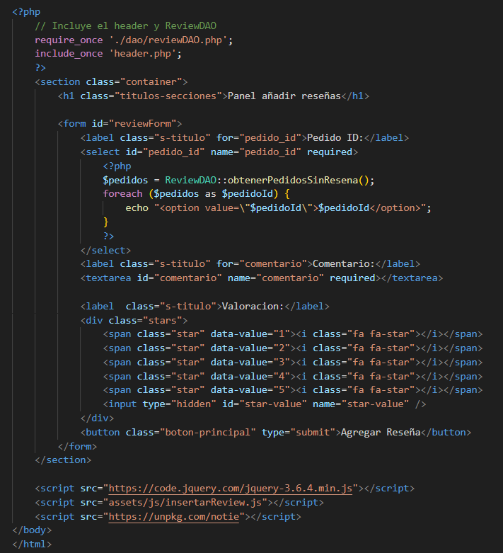
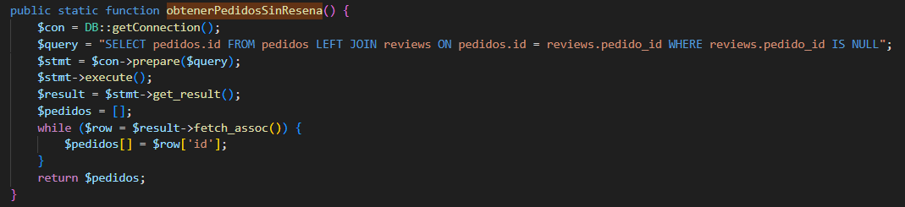

En esta imagen se ve el js para insertar las reseñas en la base de datos, también hace una peticion a la api la cual se encarga de insertar los datos, y usa el 'notie.alert' para informar al usuario de la accion que acaba de realizar.
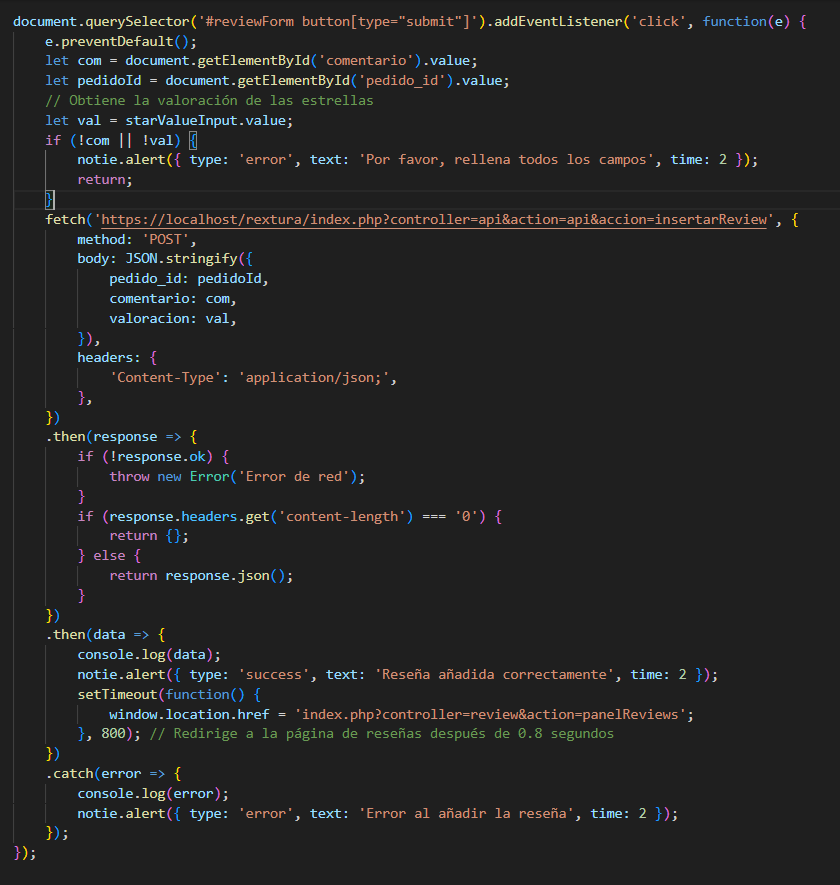

Asi es como la api gestiona la peticion e inserta los datos.
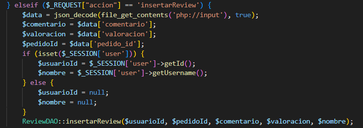

Esta es la funcion en reviewDAO para insertar las reseñas.
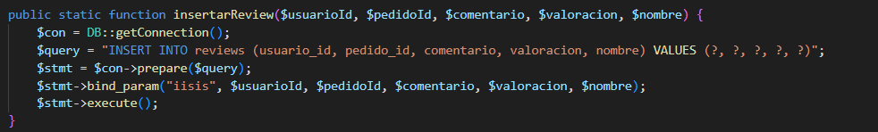

Para aplicar filtros a las reseñas se ha usado un archivo js distinto, y controla el orden segun el parametro que tenga el select del HTML, y controla el display de las reseñas segun el value de los checkboxs.
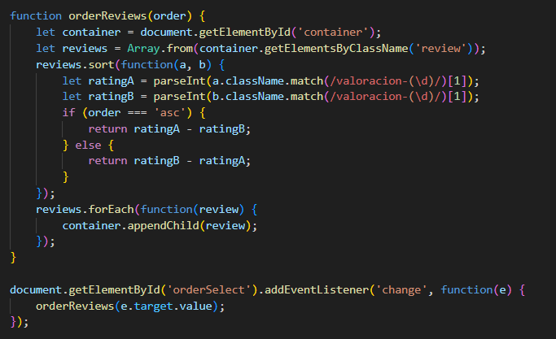
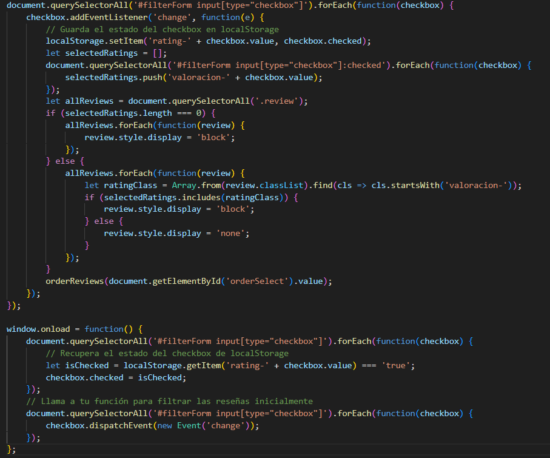

2-AÑADIR PROGRAMA DE FIDELIDAD Y USAR PROPINAS EN EL CARRITO

En esta imagen se ve el trozo de HTML en el que se trabajara con los puntos del usuario, tanto para mostrarlos como para calcular el total segun este marcado o no la opcion de usarlos.También con las propinas, que segun el valor del campo el total del carrito se actualiza.
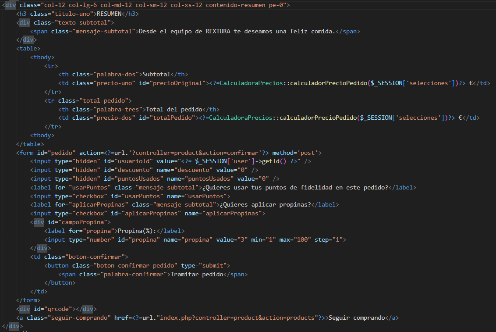

Esta funcion permite calcular y mostrar los puntos que se ganara en el pedido segun el total de el carrito en ese momento.
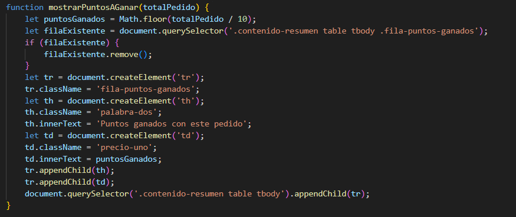

En esta imagen se hace una peticion a la api con la accion de 'obtenerPuntos' para controlar controlar el valor de los puntos para calcular el total del carrito.
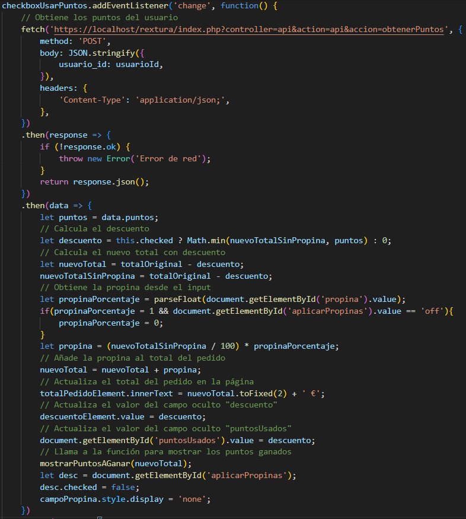

Esta es la api.
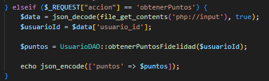

En esta imagen también controla el valor, pero esta vez de las propinas, para así poder mostrar el valor dependiendo de si estan los checkbox marcados o no.
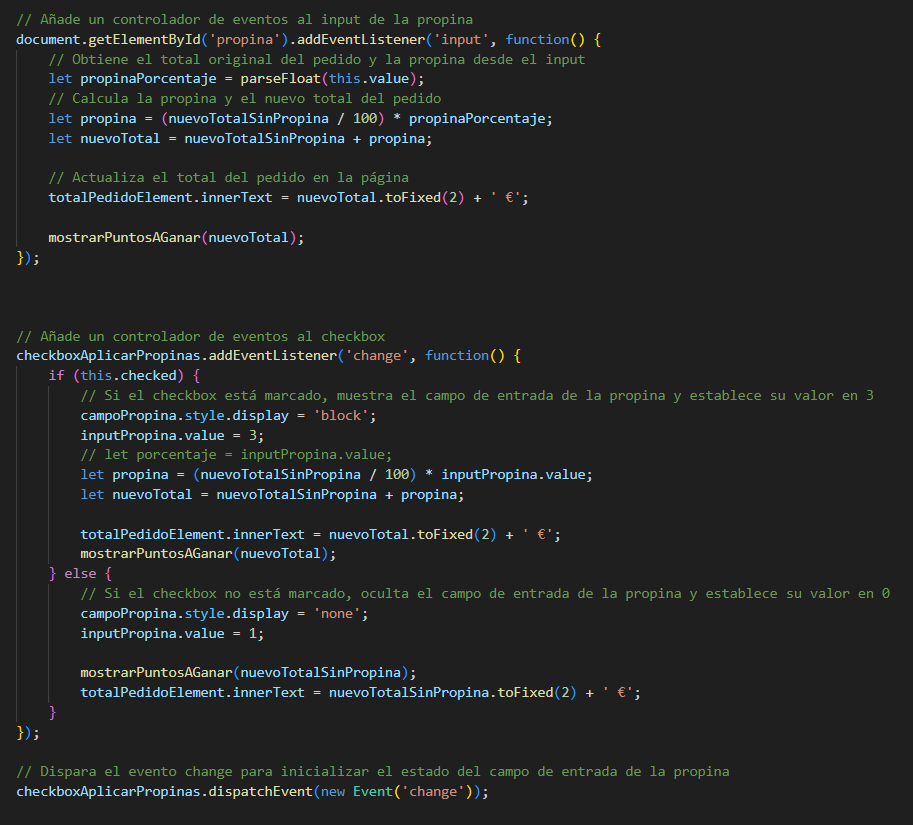

Y en esta imagen se ve el js que controla los puntos cuando se realiza el pedido. Se encarga de restar los puntos usados y posteriormente sumar los puntos ganados en ese pedido. Para hecer estas 2 cosas hace uso de la api, la accion 'restablecerPuntos' para eliminarlos y la accion 'actualizarPuntos' para sumar los nuevos.
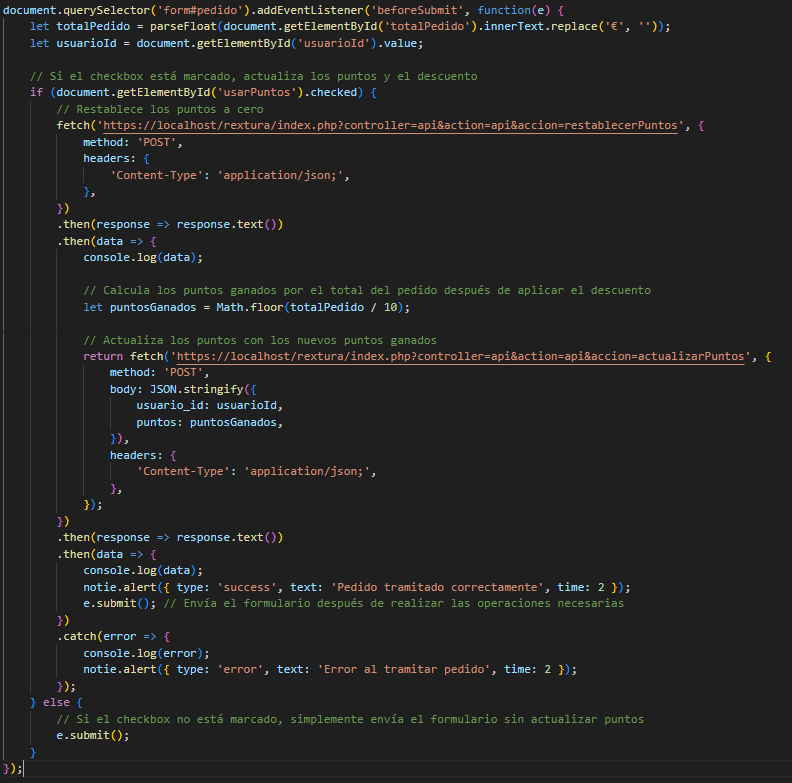

 Estas son las acciones en la api.
 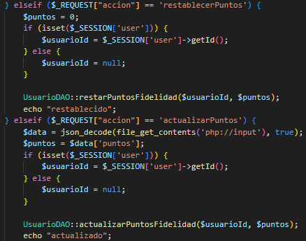

Por ultimo, este es el js que maneja el mostrar los puntos que tiene el usuario disponibles para usar en el pedido. También hace uso de la accion 'obtenerPuntos' de la api.
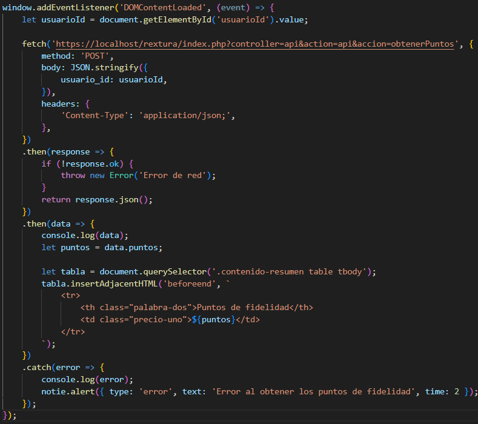

3-FILTROS PRODUCTOS
Este es el HTML donde se añade el div con los distintos checkbox para filtrar por categoria.
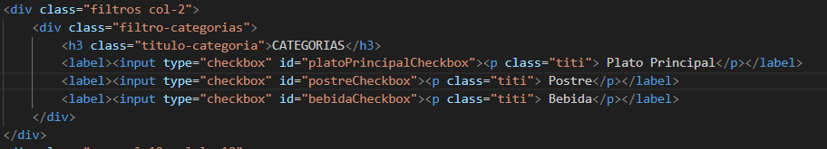

Este es el js que maneja el filtro de los productos segun el estado del checkbox, mostrara todos los productos que tengan la misma categoria que el/los checkbox marcados, también maneja el caso en el que no hay ningun checkbox marcado para que muestre todos los productos. 
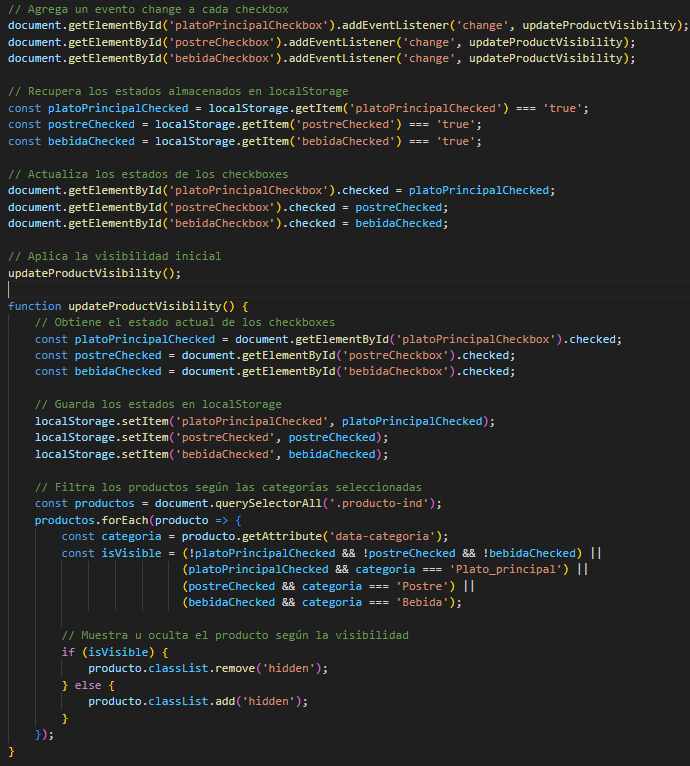

Para mostrar o ocultar los productos hace uso de añadir o quitar una clase llamada 'hidden', que mediante el display: none; hace que no se vea ese producto.
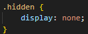

4-QR CON INFORMACION PEDIDO
Para crear los QR se ha hecho uso de una libreria llamada 'qrcodejs'. Y este es el script que controla la creacion del QR al confirmar el pedido.
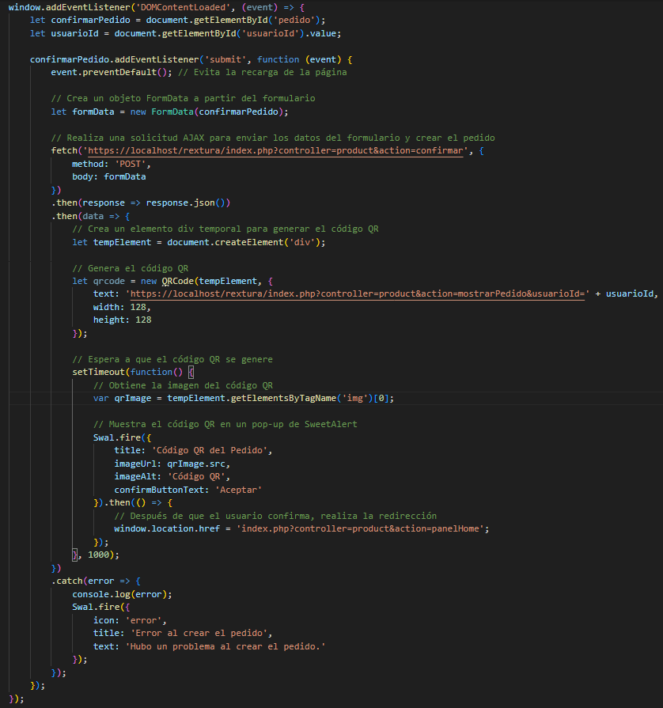

En el script se usa el '.preventDefault' para que no se realize la accion de confirmar el pedido y poder obtener los datos, despues se envia a la funcion confirmar de productController los datos del pedido usando un FormData, la cual después de hacer su funcion de insertar el pedido a la base de datos devuelve un json con el valor del 'pedido_id'.
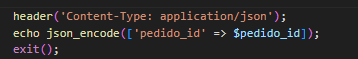

Seguidamente el script crea el QR usando la libreria de 'qrcodejs', y usando la libreria de 'Sweet Alert' muetra un pop up con la imagen del QR y cuando cierras el pop up te redirije a la Home.

El QR tiene como enlace una funcion en productController llamada mostrarPedido, la cual se encarga de recoger el id del usuario mediante el metodo $_GET y con este id saca los datos del ultimo pedido de ese usuario mediante unas funciones DAO, y muestra estos datos en el HTML de 'panelInfoPedido.php'.
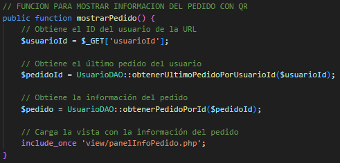

Así són las funciones DAO.
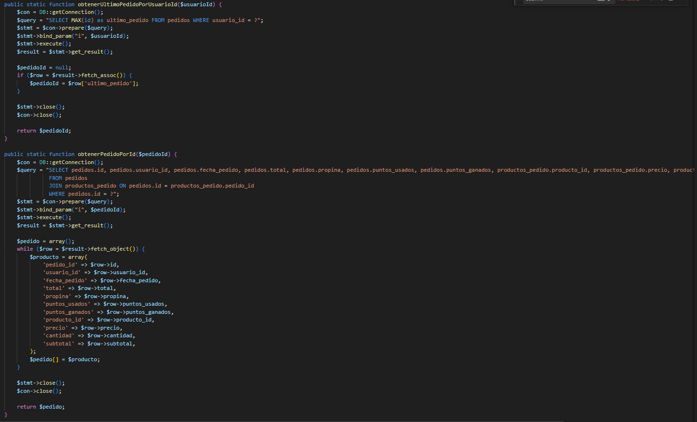