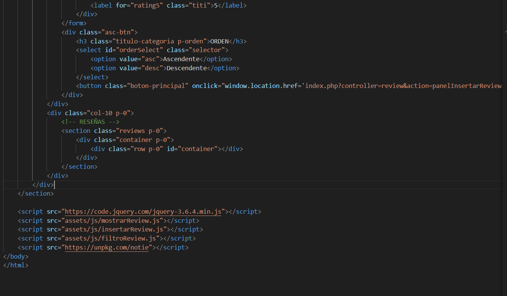
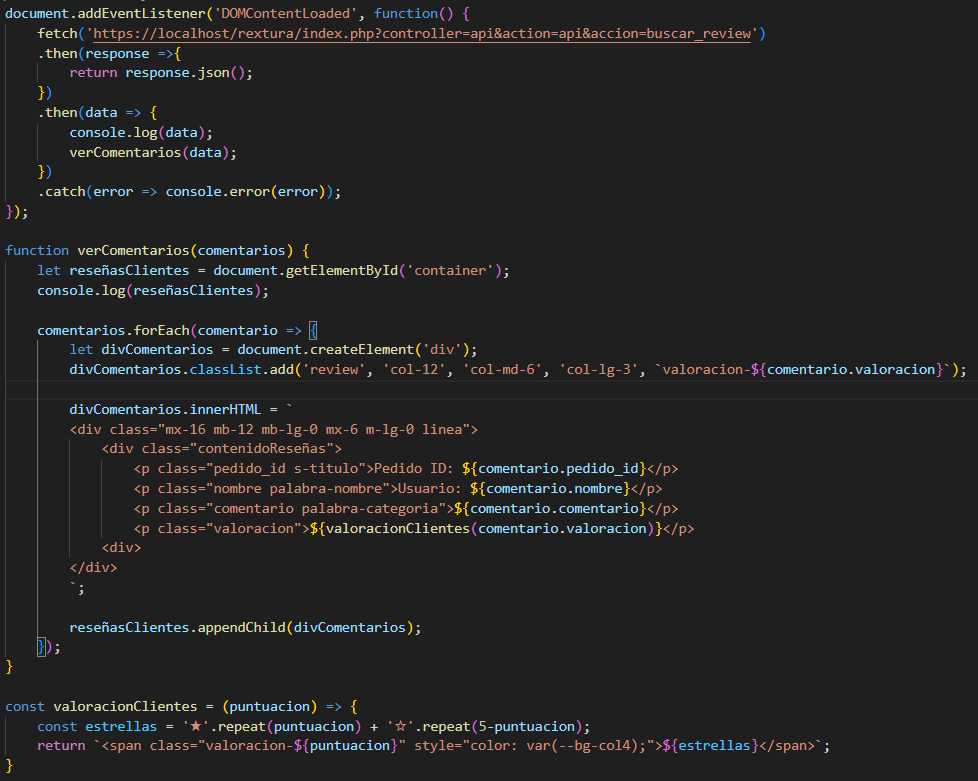
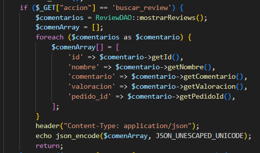
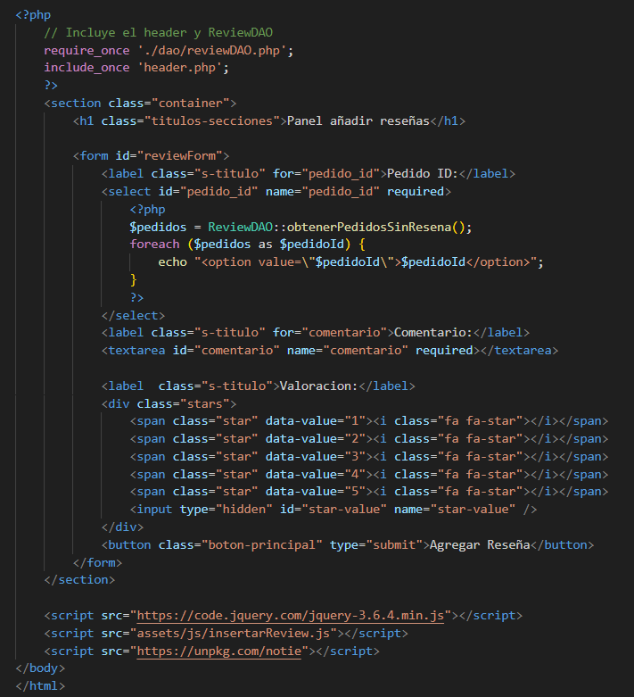

ARCHIVO README CON LA EXPLICACIÓN DE LAS NUEVAS FUNCIONALIDADES AÑADIDAS AL PROYECTO USANDO JS

1-AÑADIR RESEÑAS DEL RESTAURANTE

En la imagen se arriba se puede ver el codigo HTML donde haciendo uso del DOM mediante js se le añadiran los datos de la reseña.

En esta imagen se puede ver el js que se encarga de hacer una peticion a la api con la accion de 'buscar_review' para recuperar los datos de las reseñas y posteriormente mediante el DOM añadirlas al HTML.

Así es como se gestiona la peticion en la api.

En esta imagen se ve el HTML para añadir la reseña, la cual tiene un js para acceder a los datos e insertarlos a la base de datos.