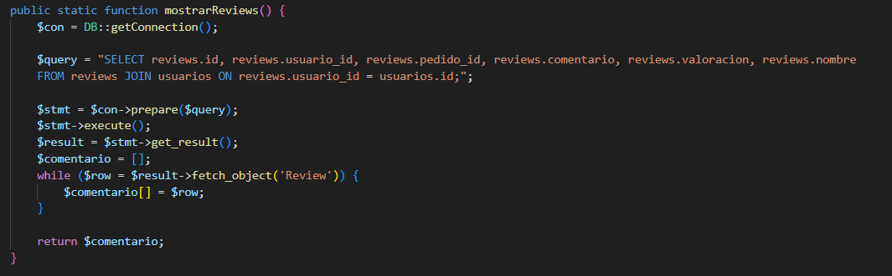
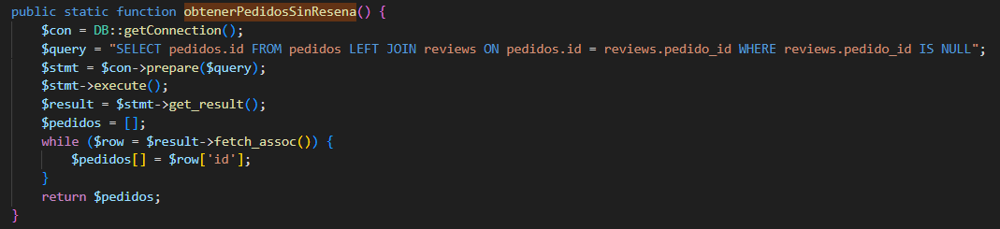
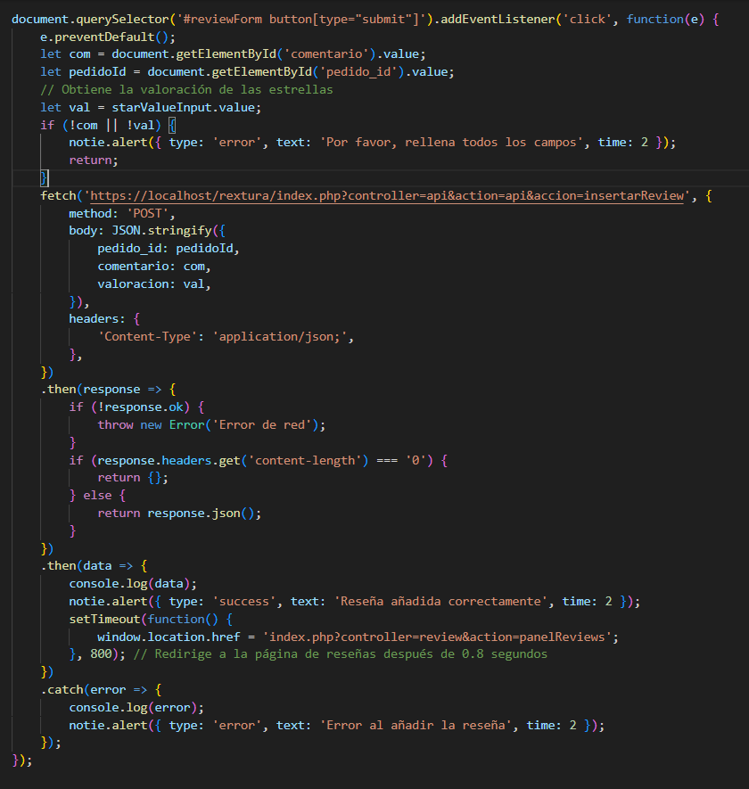
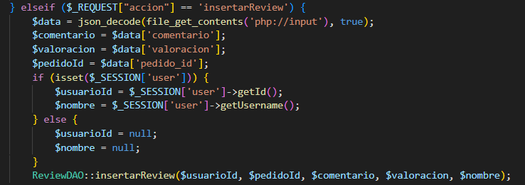
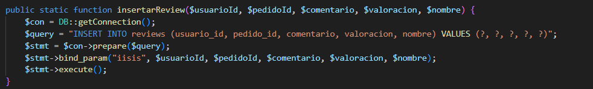
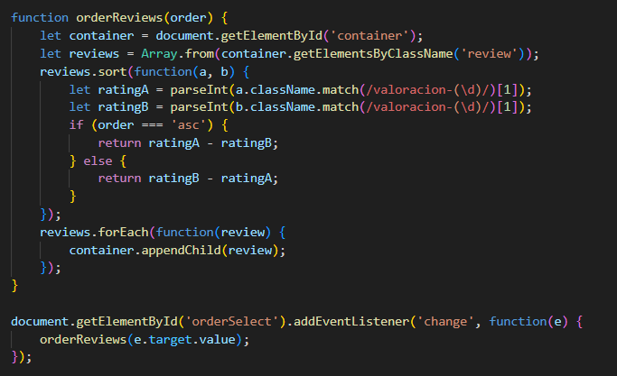
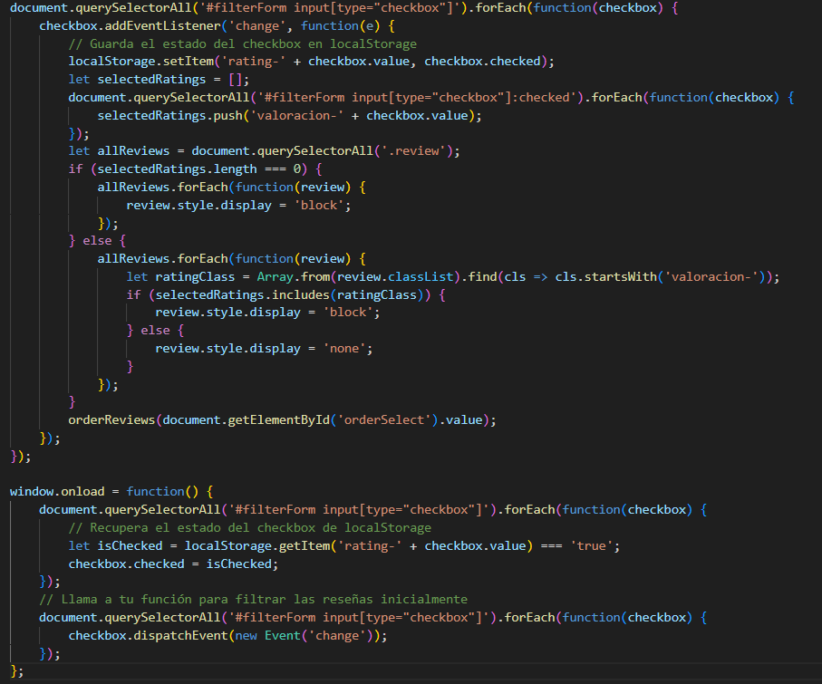

ARCHIVO README CON LA EXPLICACIÓN DE LAS NUEVAS FUNCIONALIDADES AÑADIDAS AL PROYECTO USANDO JS

1-AÑADIR RESEÑAS DEL RESTAURANTE
En la imagen se puede ver el codigo HTML donde haciendo uso del DOM mediante js se le añadiran los datos de la reseña.

En esta imagen se puede ver el js que se encarga de hacer una peticion a la api con la accion de 'buscar_review' para recuperar los datos de las reseñas y posteriormente mediante el DOM añadirlas al HTML.

Así es como se gestiona la peticion en la api.

Esta es la funcion en reviewDAO para mostrar las reseñas.

En esta imagen se ve el HTML para añadir la reseña, la cual tiene un js para acceder a los datos e insertarlos a la base de datos, también hece uso de una funcion para solo mostrar los pedidos que no tienen reseña.

En esta imagen se ve el js para insertar las reseñas en la base de datos, también hace una peticion a la api la cual se encarga de insertar los datos, y usa el 'notie.alert' para informar al usuario de la accion que acaba de realizar.

Asi es como la api gestiona la peticion e inserta los datos.

Esta es la funcion en reviewDAO para insertar las reseñas.

Para aplicar filtros a las reseñas se ha usado un archivo js distinto, y controla el orden segun el parametro que tenga el select del HTML, y controla el display de las reseñas segun el value de los checkboxs.

2-AÑADIR PROGRAMA DE FIDELIDAD